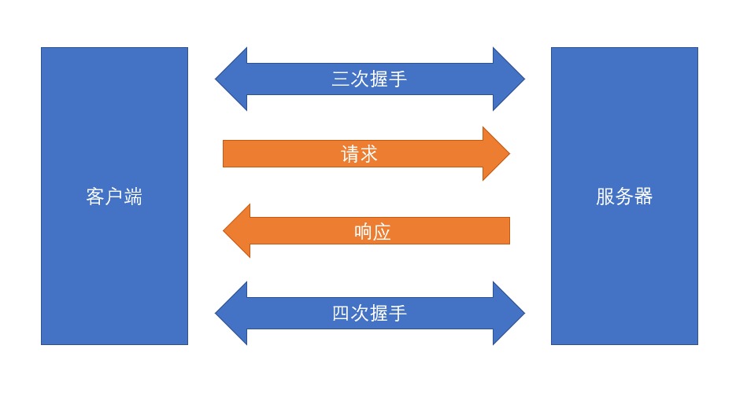
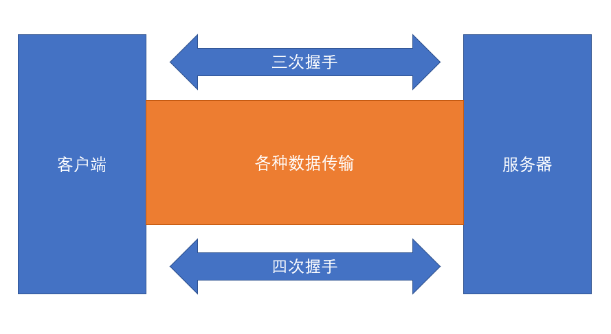
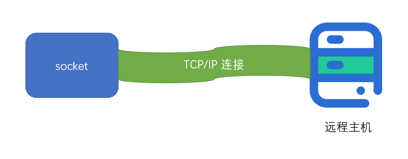
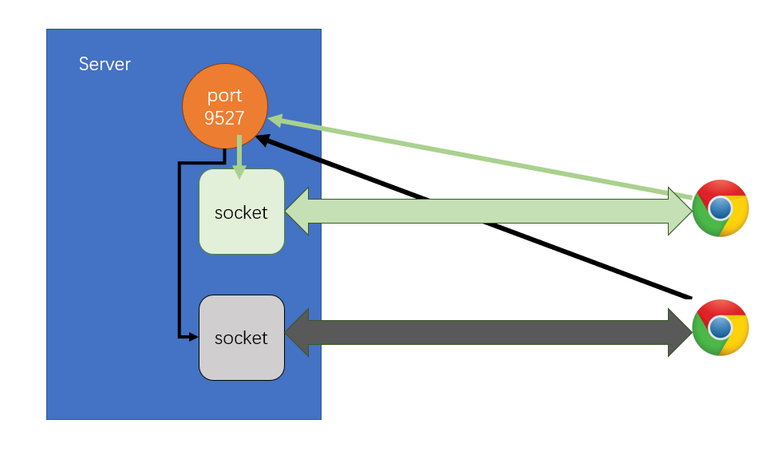

# net模块

## 回顾http请求

1. 普通模式
   
2. 长链接模式
   

## net模块能干嘛

1. net模块是一个通信模块

2. 利用它可以实现
    - 进程间的通信 IPC
    - 网络通信 TCP/IP
### 创建客户端

``net.createConnection({域名,端口}, callback)``

**返回：sockt**
   1. sockt是一个特殊的文件
   2. 在node里表现为一个双工流对象
   3. 通过向流写入内容大宋数据
   4. 通过监听流的内容获取数据
   


模拟通过http协议发送请求的响应数据处理
```js
// 导入net模块
const net = require('net')
// 创建客户端
const socket = net.createConnection({
    // 域名
    // 端口
    host: 'ke.qq.com',
    port: 80
}, () => {
    console.log('连接成功！')
})
let receive = null

/**
 * 提炼出响应字符串中的消息体和消息头
 * @param {*} response 响应原数据
 * @returns 
 */
function parseResponse(response) {
    // 1. 响应行 + 响应头   
    // 2. 响应体
    // 获取响应体开始的位置
    const index = response.indexOf('\r\n\r\n')
    // 截取（响应头+响应行）字符串
    const head = response.substring(0, index)
    // 将字符串通过换行符转化为数组
    const headParts = head.split('\r\n')
    //截掉响应行，得到只有响应头的数组
    // 将数组每项再处理成一个只有两项的数组
    // 第一项为key 第二项为value
    const headerArray = headParts.slice(1).map(str => {
        return str.split(':').map(s => {
            return s.trim()
        })
    })
    // 处理数组得到响应头对象
    // 拍扁处理
    // 将数组每项的item[0]作为对象的一个key，item[1]作为该key的value
    // 返回该对象
    const header = headerArray.reduce((a, b) => {
        a[b[0]] = b[1]
        return a
    }, {})
    // 头部去空符，得到响应体字符串
    const body = response.substring(index + 2).trimStart()
    // 返回响应数据
    return {
        header,
        body
    }
}
/**
 * 判断数据是否传输完成
 * @returns 
 */
function isOver() {
    // 总数据长度
    const contentLength = +receive.header["Content-Length"]
    // 当前已传输数据长度
    const currentLength = Buffer.from(receive.body, 'utf-8').byteLength
    return currentLength >= contentLength
}
// 监听数据传输事件
socket.on('data', chunk => {
    // 得到原数据
    const response = chunk.toString('utf-8')
    if (!receive) {
        // 第一次流传输
        // 给响应数据赋值
        receive = parseResponse(response)
        // 若第一次就传递完成
        if (isOver()) {
            // 结束长连接
            socket.end();
            console.log('来自服务器的消息')
        }
        return
    }
    // 不是第一次传输
    // 给之前的响应数据响应体字符串进行拼接
    receive.body += chunk
    // 拼接完后再判断是否传递完
    if (isOver()) {
        // 传递完，结束长连接
        socket.end();
        console.log('来自服务器的消息')
        return
    }


})
socket.write(`GET / HTTP/1.1
Host:ke.qq.com

`);
// 监听长连接关闭事件
socket.on('close', () => {
    console.log(receive.body)
    console.log('结束了！')
})
```

### 创建服务器
1. ``net.createServer()``
2. 返回：server对象
    - ``server.on('listening',()=>{})`` 服务器开始监听事件
    - ``server.on('connection',socket=>{})`` 
      - 当某个链接的到来，触发该函数
      - 事件的监听函数会获得一个socket对象
  


创建响应服务器

```js
// 导入net模块
const net = require('net')
const fs = require("fs")
const path = require('path')

const server = net.createServer()
server.listen(9529)
server.on('listening', () => {
    console.log('listening')
})
server.on('connection', socket => {
    console.log('有客户端链接')

    socket.on('data', async chunk => {
        const filename = path.resolve(__dirname, "./hsq.jpg");
        const bodyBuffer = await fs.promises.readFile(filename);
        const headBuffer = Buffer.from(`HTTP/1.1 200 OK
Content-Type: image/jpeg
Access-Control-Allow-Headers: *

`,
            "utf-8"
        );
        const result = Buffer.concat([headBuffer, bodyBuffer]);
        console.log(bodyBuffer, headBuffer, result);
        socket.write(result);


        //         const fileName = path.resolve(__dirname, './hsq.jpg')
        //         const bodyBuffer = await fs.promises.readFile(fileName)
        //         const headerBuffer = Buffer.from(`HTTP/1.1 200 OK
        // Content-Type:image/jpeg

        // `,
        //             'utf-8'
        //         );
        //         const result = Buffer.concat([headerBuffer, bodyBuffer])
        //         console.log(bodyBuffer)
        //         socket.write(result)


        //         socket.write(`HTTP/1.1 200 OK
        // Content-Type:text/plain

        // <!DOCTYPE html>
        // <html lang="en">
        // <head>
        //   <meta charset="UTF-8">
        //   <meta http-equiv="X-UA-Compatible" content="IE=edge">
        //   <meta name="viewport" content="width=device-width, initial-scale=1.0">
        //   <title>Document</title>
        // </head>
        // <body>
        // <h1>hello</h1>
        // </body>
        // </html>`)

        socket.end();
    });
    socket.on('end', () => {
        console.log('链接关闭了 ')
    })
})
```